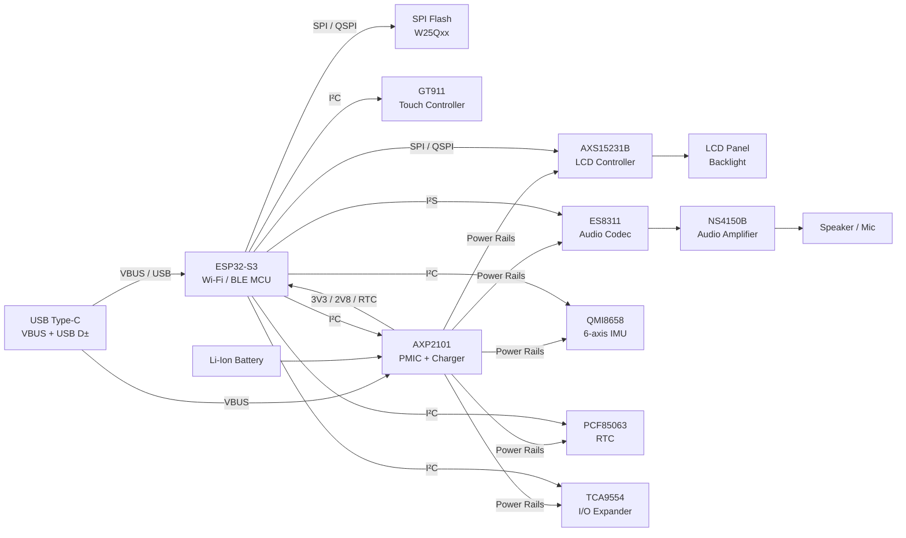

# esphome-ha-interface-panel

An ESPHome-based touch screen panel to install in your house to interface with HomeAssistant.
This project is based on the [esphome-modular-lvgl-buttons library][1].

## Hardware Required

Check the [esphome-modular-lvgl-buttons library][1] project for a list of supported (touch)screens.

I'm currently using the [WaveShare ESP32-S3-Touch-LCD-3.5B](https://www.waveshare.com/wiki/ESP32-S3-Touch-LCD-3.5B)

TODO ADD PHOTO


## Hardware Details


| Chip        | Type / Function            | What it does (short)                                   |
|-------------|----------------------------|--------------------------------------------------------|
| AXS15231B   | Display Controller/Driver  | Drives LCD/TFT displays (and often touch panels)       | ????
| GT911       | Capacitive touch Ctrl      | Controller                                             | ????
| QMI8658     | IMU sensor                 | 6-axis motion sensing (accelerometer + gyroscope)      | OK
| PCF85063    | Real-Time Clock (RTC)      | Keeps date/time with ultra-low power                   | ????
| AXP2101     | Power Management IC (PMIC) | Battery charging, power regulation, power sequencing   | OK
| ES8311      | Audio Codec                | Audio ADC/DAC for mic input and speaker/headphone out  | OK
| W25Q128JVSIQ | External SPI flash memory | 16MB NOR-Flash Memory                                  | OK

Block diagram:



Mapping between ESP chip and the AXS15231B controller:

```
LCD_CS      GPIO12
LCD_SCLK    GPIO5
LCD_DATA0   GPIO1
LCD_DATA1   GPIO2
LCD_DATA2   GPIO3
LCD_DATA3   GPIO4
LCD_BL      GPIO6
```

and for the Touchscreen interface (TP interface):

```
TP_SCL      GPIO7
TP_SDA      GPIO8
TP_INT      Accessible via GPIO expander TCA9554PWR
```

The GPIO expander (ESP) TCA9554PWR is connected to the ESP32 chip using the I2C bus:

```
ESP_SCL      GPIO7
ESP_SDA      GPIO8
```


## Software

There are 2 ways to develop software for Waveshare devices, as suggested by Waveshare:

1. VSCode + ESP-IDF extension
2. Arduino IDE

However I've chosen a third way: using **ESPHome**.
I contributed to the [esphome-modular-lvgl-buttons library][1] the support for the Waveshare
hardware board and this repository contains a working `main.yaml` ESPHome configuration file that can be used to generate the actual firmware binary and flash it on the board.


## Photos

TO BE WRITTEN

## How to Develop

TO BE WRITTEN

## Links

A few links to other similar projects:

* https://github.com/bennydiamond/esphome_lvgl_hmi_garage
 

[1]: https://github.com/agillis/esphome-modular-lvgl-buttons