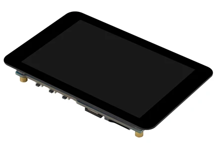

# ESPHome HomeAssistant Interface Panel

An [ESPHome](https://esphome.io/)-based touch screen panel to install in your house to interface with [Home Assistant](https://www.home-assistant.io/).
This project is based on the [esphome-modular-lvgl-buttons library][1].

## Hardware Required

Check the [esphome-modular-lvgl-buttons library][1] project for a list of supported (touch)screens.

To use this project you should have an ESP32-powered board with an LCD screen of roughly 3.5 inches.
I'm currently using the [WaveShare ESP32-S3-Touch-LCD-3.5B][2].
Alternatives include the `Guition`  and `Sunton` devices.




## Hardware Details

See [Hardware Details page](./docs/hardware.md)


## Software/Firmware Overview

There are 2 ways to develop software for Waveshare devices, as suggested by Waveshare:

1. VSCode + ESP-IDF extension
2. Arduino IDE

However I've chosen a third way: using **ESPHome**.
[ESPHome](esphome.io) has support for all chips installed on the Waveshare device, see [Hardware Details page](./docs/hardware.md) and offers seamless integration
with [Home Assistant](https://www.home-assistant.io/)

This repository contains a working [main.yaml](./main.yaml) ESPHome configuration file that can be used to generate the actual firmware binary and flash it on the board.
Please note that this is an [ESPHome package](https://esphome.io/components/packages/) and thus it uses [substitutions](https://esphome.io/components/substitutions/) to make the YAML config file as reusable as possible.

The ESPHome firmware uses the [LVGL Graphics](https://esphome.io/components/lvgl/) to render the UI on the display.

In addition this repository provides 2 more ESPHome configuration files:

* [dev-sdl.yaml](./dev-sdl.yaml): this is a development-friendly version of [main.yaml](./main.yaml) that 
allows for quick iteration on your computer, using the SDL backend of ESPHome (so you can test UI changes without re-flashing all the times the real device).

* [self-contained.yaml](./self-contained.yaml): this is a self-contained ESPHome firmware that does NOT use the [esphome-modular-lvgl-buttons library][1]. I used this as early experiment to interface the Waveshare panel with ESPHome.

NOTE: Although I contributed to the [esphome-modular-lvgl-buttons library][1] the support for the Waveshare hardware board after some time I decided to decouple this project from [1]


## Software/Firmware Installation

For the very-first FLASH on the board, please use the CLI method described below.

### Using ESPHome Builder

See [ESPHome usage from Home Assistant UI](https://esphome.io/guides/getting_started_hassio/).
Assuming you have ESPHome Builder installed and running,
follow this step by step procedure:

1. Click "New Device" in ESPHome Builder interface and choose "Empty Configuration"

2. Copy-paste the following config:

```yaml
packages:
  remote_package_files:
    url: https://github.com/f18m/floor-heating-controller/
    files: 
      - path: main.yaml
        vars:
          encryption_key: !secret encryption_key
          wifi_ssid: !secret wifi_ssid
          wifi_password: !secret wifi_password
          wifi_ap_password: !secret wifi_ap_password
          ota_password: !secret ota_password
    ref: main  # optional
    refresh: 1d  # optional

esphome:
  name: "interfacepanel-p0"
  friendly_name: InterfacePanel-P0
```

Make sure your ESPHome Builder `secrets` file contains above keys
to allow the device to talk to your Wifi network and your HomeAssistant instance.

3. Hit "Validate" and then "Install".


### Using Command Line

See [ESPHome CLI intro](https://esphome.io/guides/getting_started_command_line/).
Assuming you have `esphome` CLI utility working fine (e.g. you can run `esphome version`), follow this step by step procedure:

1. Git clone this repository

2. Create a `secrets.yaml` file containing all secrets 
to allow the device to talk to your Wifi network and your HomeAssistant instance.

3. If this is the first time you're flashing the board (brand new device),
connect the board via USB to the local computer and
update the `Makefile` to point to the right USB-TTY device, e.g. `/dev/ttyACM0`.
If you're just updating the firmware, then you can do OTA update, just make sure
that the IP in the `Makefile` is correct.

3. Run `make flash-main` to do an update over the air (OTA). Run `make flash-main LOCALLY_ATTACHED=1` to do an update via an USB cable.


## Installation within the electrical/wall box

See [Hardware Install](./docs/hardware-install.md).


## Screenshots & Photos

TO DO 


## How to Develop

Editing the LVGL configuration via YAMLs is a pain but after a while you will get used to it.
The most useful command to develop changes to the UI is:

```sh
make test-local
```

that will use the SDL backend of ESPhome to render locally on your Linux workstation.
Maintain the differences between [main.yaml](./main.yaml) and [dev-sdl.yaml](./dev-sdl.yaml) as minimal as possible
to avoid mismatches between the SDL rendering and the actual rendering on the device.


## Links

A few links to other similar projects:

* https://github.com/bennydiamond/esphome_lvgl_hmi_garage
* https://github.com/kancelott/neo-nesp
* https://github.com/hareeshmu/climate-control-display
 

[1]: https://github.com/agillis/esphome-modular-lvgl-buttons
[2]: https://www.waveshare.com/wiki/ESP32-S3-Touch-LCD-3.5B