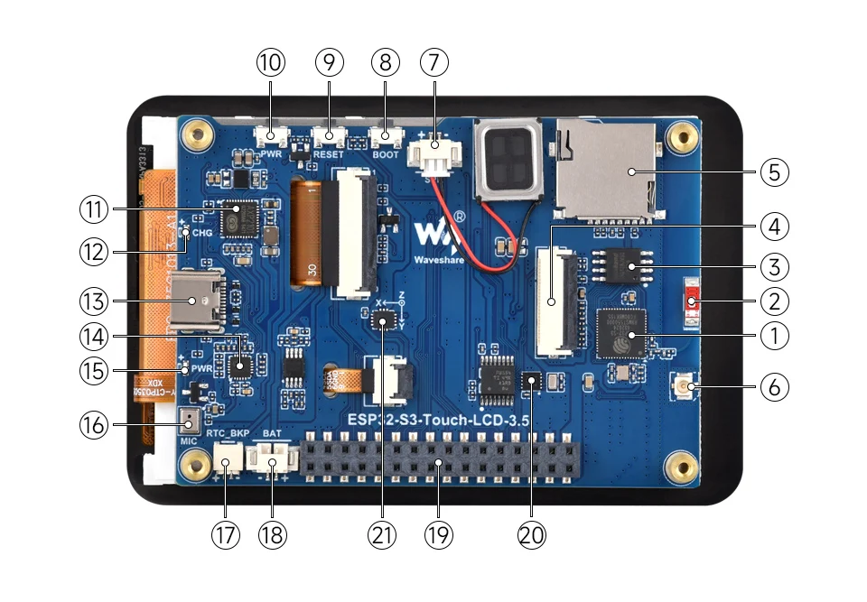
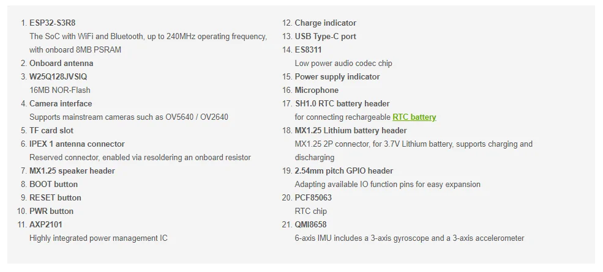
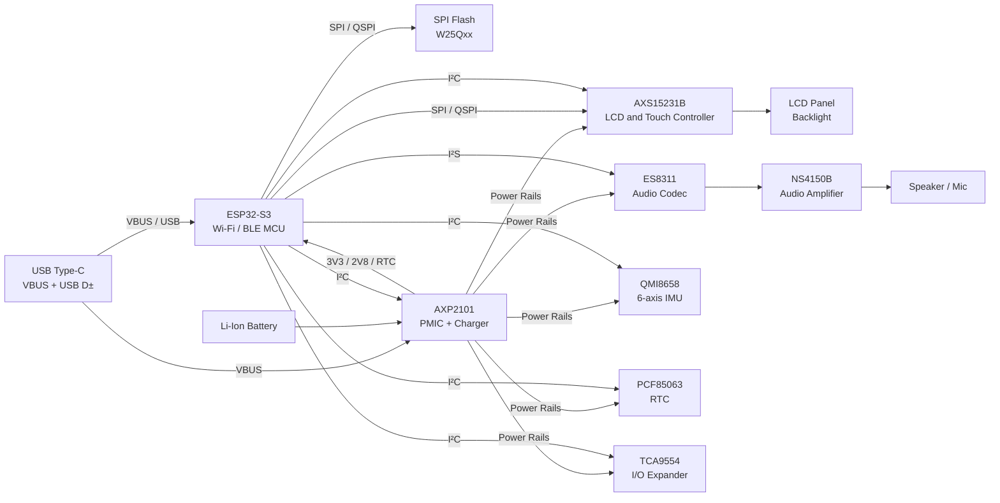

# Electronics Details

# Overview

# Details

The [WaveShare ESP32-S3-Touch-LCD-3.5B][2] board is equipped with:

| Chip        | Type / Function            | What it does (short)                                   |
|-------------|----------------------------|--------------------------------------------------------|
| [AXS15231B](docs/AXS15231B_Datasheet_V0.5.pdf)   | Display Driver and Touch Panel Controller  | Drives LCD/TFT displays and touch panels       | 
| [QMI8658](docs/QMI8658C.pdf)     | IMU sensor                 | 6-axis motion sensing (accelerometer + gyroscope)      |
| [PCF85063](docs/PCF85063A.pdf)    | Real-Time Clock (RTC)      | Keeps date/time with ultra-low power                   |
| [AXP2101](docs/X-power-AXP2101_SWcharge_V1.0.pdf)     | Power Management IC (PMIC) | Battery charging, power regulation, power sequencing   |
| [ES8311](docs/ES8311.DS.pdf)      | Audio Codec                | Audio ADC/DAC for mic input and speaker/headphone out  |
| [W25Q128JVSIQ](docs/W25Q128JV.pdf) | External SPI flash memory | 16MB NOR-Flash Memory                                  |
| [TCA9554](docs/TCA9554.pdf)     | Port Expander              | Provides extra connections to e.g. LCD and Touch lines |

Block diagram:

Mapping between ESP chip and the AXS15231B controller:

| Signal    | GPIO |
|-----------|------|
| LCD_CS    | GPIO12 |
| LCD_SCLK  | GPIO5 |
| LCD_DATA0 | GPIO1 |
| LCD_DATA1 | GPIO2 |
| LCD_DATA2 | GPIO3 |
| LCD_DATA3 | GPIO4 |
| LCD_BL    | GPIO6 |

and for the Touchscreen interface (TP interface):

| Signal | Connection |
|--------|------------|
| TP_SCL | GPIO7 |
| TP_SDA | GPIO8 |
| TP_INT | Accessible via GPIO expander TCA9554PWR |

The GPIO expander (ESP) TCA9554PWR is connected to the ESP32 chip using the I2C bus:

| Signal  | GPIO |
|---------|------|
| ESP_SCL | GPIO7 |
| ESP_SDA | GPIO8 |

I measured the board power consumption to be roughly:

* 160mA at startup
* 110mA in idle

powering the board at 5V through the back-of-the-board connector.
This shows an amazing <1W power consumption!

[2]: https://www.waveshare.com/wiki/ESP32-S3-Touch-LCD-3.5B