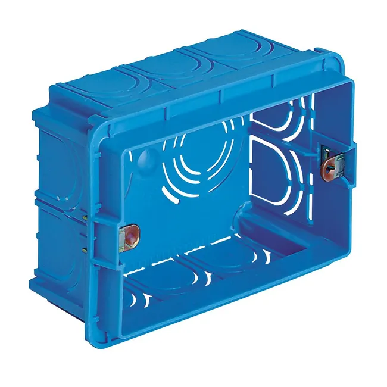
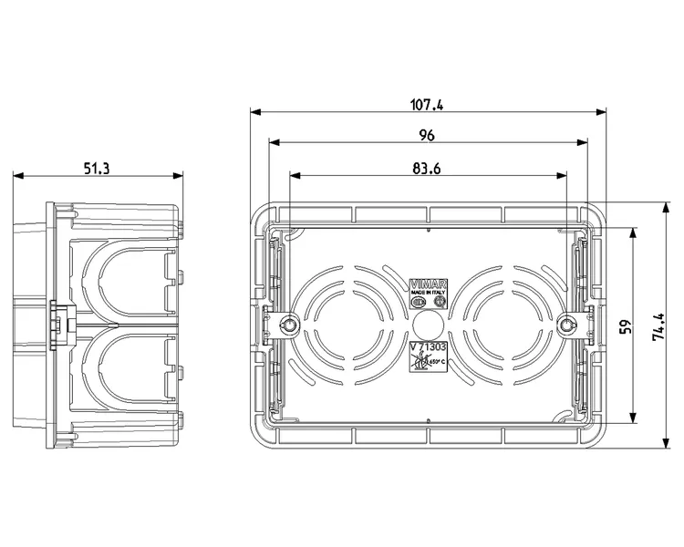
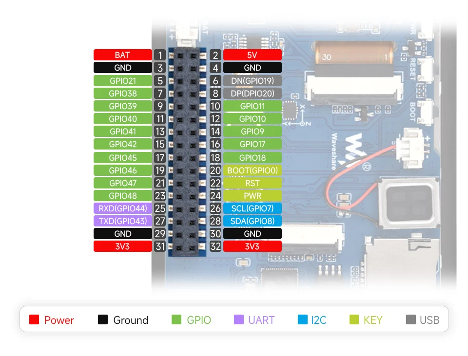
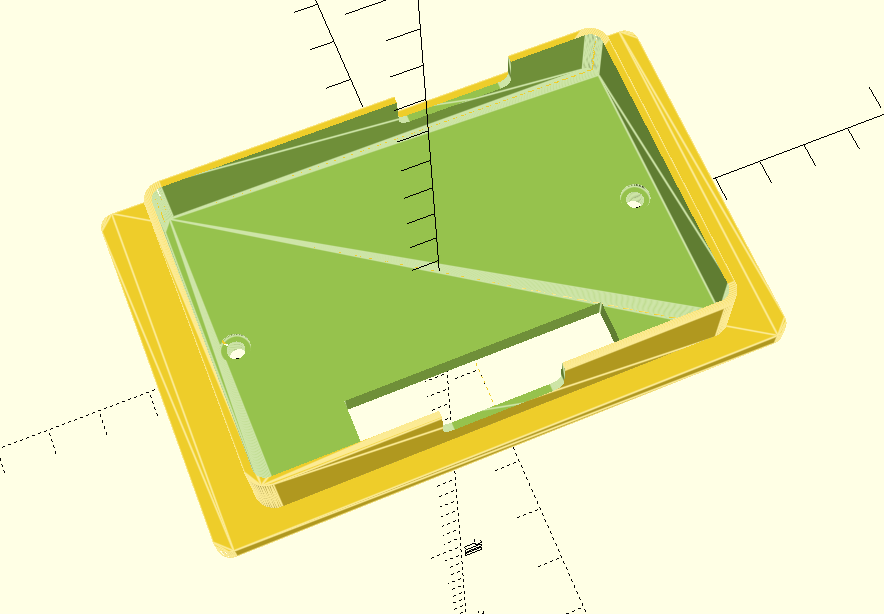
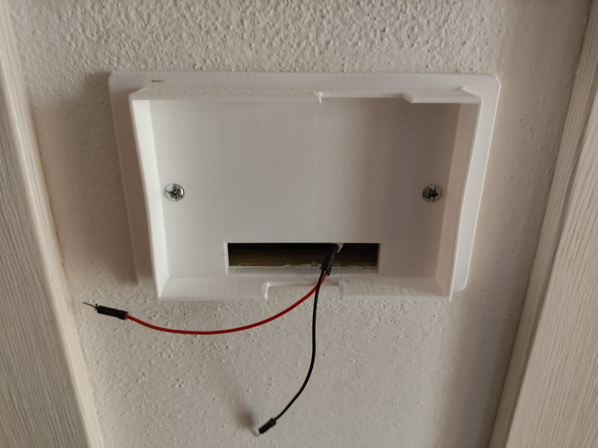

# Hardware Installation within the electrical/wall box

In my country (Italy), the typical wall box is the so-called `503` model, with dimensions of inner usable space roughly equal to:

* width: 96mm
* height: 70mm
* depth: 48mm

Here's a couple of pics of the wall box to get an idea:

These play well with the Waveshare 3.5'' board which has dimensions:

* width: 95mm
* height: 59mm
* depth: 14mm

Moreover the board has a connector on the back which supports injecting the 5V power
from a convenient power supply installed on the back of the panel:

So I designed an [adapter plate](./wall-box-adapter/waveshare-503wallbox-adapter.scad) with [OpenSCAD](https://openscad.org/):

This can be 3D-printed. The LCD panel and its electronics are designed to be press-fit 
within an hollow box (no screws). Behind the hollow box there
are screw holes to mount the plate on the 503 wall box. 

Here's an actual picture of the adapter plate after 3D printing and mounting within the wall box:

